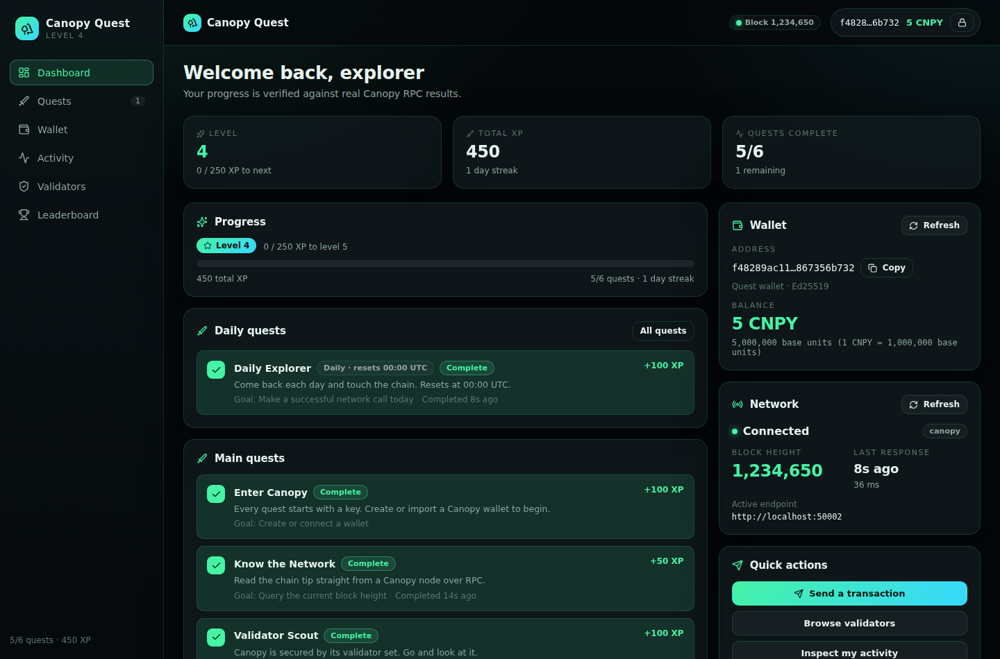

# Canopy Quest

A gamified dApp for the [Canopy](https://github.com/canopy-network) blockchain, built on the
official TypeScript SDK, [`@canopynetwork/canopy-ts`](https://github.com/canopy-network/canopy-ts).

Create or import a Canopy wallet, read live chain state, send a real signed transaction, and earn
XP for doing it. Every quest is verified against an actual SDK result — there is no "claim" button
and no simulated blockchain data anywhere in the app.



<sub>Screenshot captured against a local test RPC endpoint — the heights and balances shown are that node's, not mainnet's.</sub>

## Features

- **Local wallet** — create, import (raw key or encrypted keystore JSON), unlock, lock, and export.
  Keys are encrypted with the SDK's argon2i + AES-GCM keystore before they touch storage.
- **Live network status** — block height, active RPC endpoint, latency, last successful response,
  and a per-node health check across every configured endpoint.
- **Quest engine** — six quests scored purely from recorded SDK results, including a UTC-reset
  daily quest with a streak counter.
- **XP and levels** — a single documented progression curve with a derived (never accumulated)
  XP total, so progress cannot drift or be double-claimed.
- **Send flow** — validate → summarise → confirm → sign locally → broadcast → show the node's real
  transaction hash.
- **Validators** — the live validator set with stake, committees, and status, rendered only from
  fields the node actually returned.
- **Address activity** — paginated `events-by-address` results, each expandable to its raw payload.
- **Local demo leaderboard** — clearly labelled as browser-local, not on-chain.
- **Responsive** — desktop sidebar collapses to a bottom nav; tables become stacked cards.

## Tech stack

React 19 · TypeScript (strict) · Vite · `@canopynetwork/canopy-ts` · React Router · lucide-react ·
Vitest. No CSS framework — the theme is a small hand-written token system in `src/index.css`.

## Installation

```bash
npm install
cp .env.example .env      # then point it at a Canopy node
npm run dev               # http://localhost:5173
```

Production build and tests:

```bash
npm run build             # tsc -b && vite build
npm run preview
npm test                  # vitest
```

## Environment variables

All configuration is public: `VITE_*` variables are compiled into the client bundle and visible to
anyone using the app. **Never put a secret, admin RPC credential, or private key in them.**

| Variable | Default | Purpose |
|---|---|---|
| `VITE_CANOPY_RPC_URL` | `http://localhost:50002` | Public RPC endpoint. Comma-separate for `NodePool` failover — first is primary, the rest are fallbacks. |
| `VITE_CANOPY_NETWORK` | `canopy` | Display label for the network. |
| `VITE_CANOPY_NETWORK_ID` | `1` | `networkID` written into every signed transaction. |
| `VITE_CANOPY_CHAIN_ID` | `1` | `chainID` written into every signed transaction. |
| `VITE_CANOPY_DENOM_EXPONENT` | `6` | Decimals between the display unit and the chain's base unit. |
| `VITE_CANOPY_DENOM_SYMBOL` | `CNPY` | Ticker shown in the UI. |
| `VITE_CANOPY_FALLBACK_SEND_FEE` | `10000` | Fee used only if the node does not report `sendFee`. |

If your node does not send CORS headers, set `CANOPY_DEV_RPC_PROXY=http://your-node:50002` (no
`VITE_` prefix — dev server only) and `VITE_CANOPY_RPC_URL=/rpc`; the Vite dev server will proxy.

`.env` is gitignored; only `.env.example` is committed.

## Canopy SDK usage

Everything blockchain-related goes through `src/lib/canopy.ts` and `src/lib/wallet.ts`, using the
SDK's real APIs (subpath imports keep the bundle lean):

| SDK subpath | Used for |
|---|---|
| `/rpc` | `fetchHeight`, `account`, `validators`, `eventsByAddress`, `fees`, `supply`, `submitTx` |
| `/node-pool` | `NodePool.withFailover`, `NodePool.healthCheckAll` for multi-endpoint resilience |
| `/transaction` | `createAndSignTransaction` with `{ format: "core" }` |
| `/wallet-manager` | `WalletManager` (create, unlock, import, export, delete) with injected storage |
| `/keystore` | `encryptKeyEntry`, `importFromGoKeystore`, `KeystoreStorage` |
| `/crypto` | `deriveAddress`, `derivePublicKey`, `detectPublicKeyCurve`, `isValidAddress`, `CurveType` |
| `/errors` | `CanopyError`, `RpcError`, `TimeoutError`, `ResponseValidationError` |

Two details worth knowing:

- **`send` uses the core transaction format.** `send` is a registered core message type, so the node
  requires a protojson `msg` field and ignores `msgTypeUrl`/`msgBytes`. The app therefore passes
  `{ format: "core" }` to `createAndSignTransaction`.
- **List endpoints are async generators.** `validators` and `eventsByAddress` paginate themselves;
  the app iterates them with a bounded cap rather than hand-rolling page cursors.

## Wallet security

- Private keys are encrypted (argon2i KDF, AES-GCM) by the SDK before being written to
  `localStorage`. A plaintext key is **never** persisted.
- A decrypted key exists only in React memory inside `WalletProvider`, for as long as the tab is
  open. Locking, or closing the tab, drops it.
- The UI never displays a private key or a seed phrase, and nothing in the app logs one. Backup is
  offered as the **encrypted** keystore file, which is useless without the password.
- Signing happens entirely in the browser; only the signed transaction is broadcast.
- Removing a wallet requires an explicit confirmation and is irreversible without a backup.
- This is demo software. Do not use it to hold funds you care about.

## Architecture

```
src/
  lib/          canopy.ts (RPC + NodePool + tx), wallet.ts (keys), quests.ts (engine),
                storage.ts (persistence), format.ts (display + input validation)
  hooks/        useWallet (session, balance) → useQuests (evidence, XP) → useCanopy (height, health)
  components/   Layout, Navbar, Sidebar, WalletCard, NetworkStatus, QuestCard/QuestList,
                XPProgress, ActivityList, ValidatorList, Leaderboard, TransactionModal
  pages/        Dashboard, Quests, Wallet, Activity, Validators, LeaderboardPage
  types/        canopy.ts, quest.ts, wallet.ts
```

No blockchain calls live in components: pages call `lib/` functions and record results through the
providers. The provider order matters — quests read the connected address, and network calls record
quest evidence:

```
WalletProvider → QuestProvider → CanopyProvider
```

## Quest system

Quest completion is a pure function of **evidence**: a record of SDK calls that actually succeeded
(`src/types/quest.ts`). The UI can only ask the network for something; the recorder is invoked from
the success path of a real response, and quest state is re-derived from that evidence on every
render. There is no way for the frontend to mark a quest complete on its own.

| Quest | Verified by | XP |
|---|---|---|
| Enter Canopy | A wallet exists and is connected | 100 |
| Know the Network | `fetchHeight` returned a height | 50 |
| Validator Scout | `validators` returned a result set | 100 |
| Blockchain Explorer | `eventsByAddress` returned for your address | 100 |
| First Transaction | `submitTx` returned a transaction hash | 250 |
| Daily Explorer | A successful RPC call today (UTC) | 100/day |

**XP and levels.** Level 1 starts at 0 XP and each level costs 50 XP more than the last
(100, 150, 200, 250, 300 …), giving 0 / 100 / 250 / 450 / 700 for levels 1–5 and continuing by the
same rule — closed form `25L² + 25L − 50` (`xpForLevel`, `getLevelFromXP`, `getLevelProgress`).
XP is derived from evidence rather than accumulated, so it is always consistent with what happened.

**Daily quests.** Scored against UTC day keys (`YYYY-MM-DD` from `toISOString`), so the reset lands
at 00:00 UTC for every player regardless of local timezone. A day is recorded at most once, which is
what makes repeat-claiming impossible; the streak counter walks back over consecutive recorded days.

**Persistence.** Evidence is stored per address under `canopy-quest:v1:evidence:<address>`. Switching
wallets carries network-scoped facts forward (chain tip, validator set, days played) but never
another address's events or transactions.

## Testing

```bash
npm test
```

37 unit tests over the parts where a bug would be silent: the level curve and its boundaries, XP
derivation, quest verification from evidence, UTC daily-reset and streak logic, evidence merging
across wallets, amount parsing/precision, send-form validation, transaction-hash extraction, and
error-message mapping.

## Known limitations

- **The leaderboard is local.** Standings live in this browser; the other players are fixed demo
  entries. Nothing about it is on-chain.
- **Quest progress is browser-local** and unencrypted, keyed by address. Clearing site data resets it.
- **No transaction confirmation tracking.** The app reports the hash the node returned when it
  accepted the transaction; it does not poll for block inclusion. On-chain events show up on the
  Activity page once the transaction lands.
- **New addresses have no account.** Balance lookups fail until an address first receives funds —
  the UI says so rather than showing a fabricated zero.
- **Wallet creation is ed25519 only** (what `generateKeyPair` produces). Imports of other curves
  supported by the SDK are possible but not exposed in the UI.
- **The account keystore is local-only.** The SDK's `WalletManager.loadAccounts()` reads a node's
  *admin* keystore, which a browser dApp should not reach; this app deliberately does not call it.
- **Requires a reachable Canopy node.** With no node configured, the app degrades to error states —
  it will not invent data to fill the gap.

## License

See the repository for license details.
